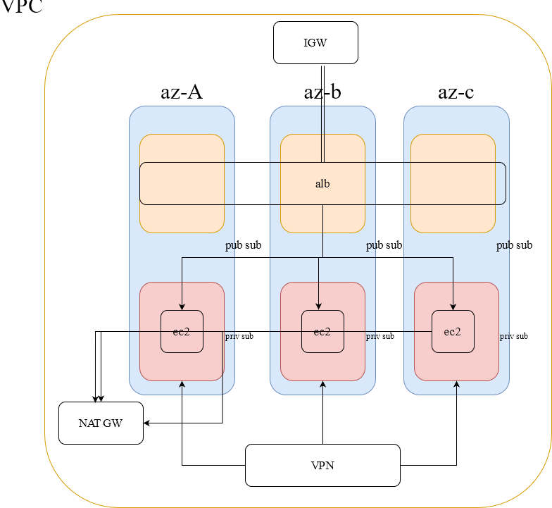

## Aws Test Infrastucture (Terraform)
# Remoted state
Used terragrunt to init remote state (s3+dynamo db) ,after s3 created input bucket name in both variables.tf 

# VPN:
Open Aws Console , go to  VPC -> VPN -> Client Vpn Endpoints and download client config.
Import client config to openvpn than open session

# Ec2:
Used a user_data method to install nginx and make page. Bc having trouble with modules and remote provisioner

# Diagram:

